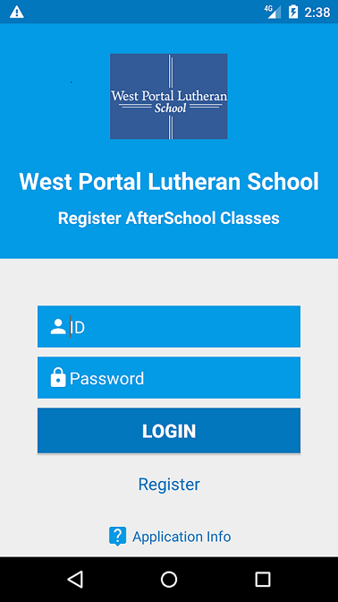
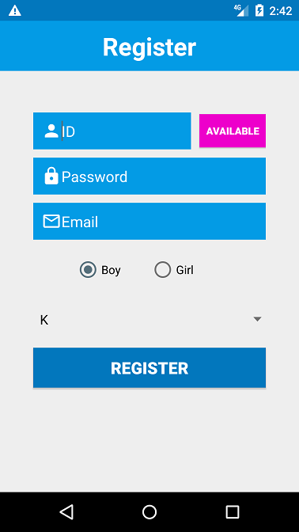
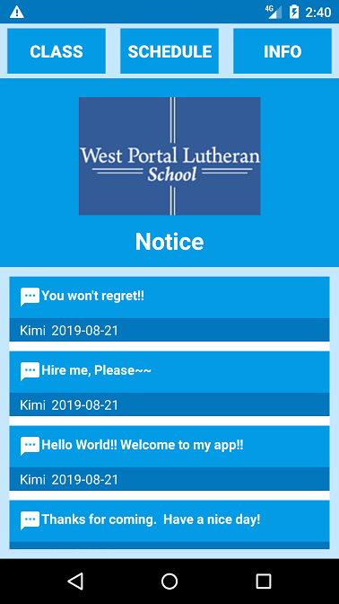
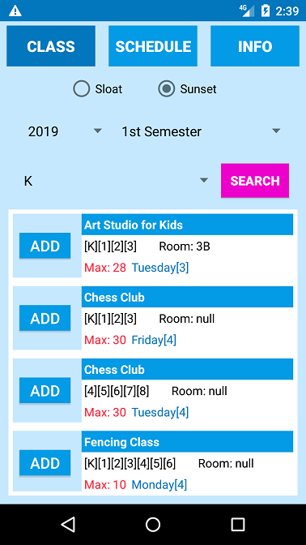
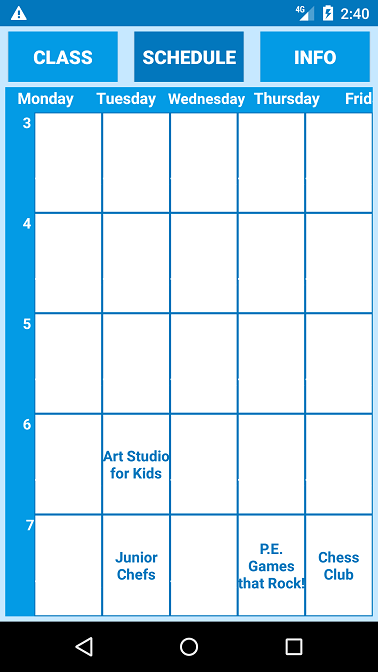
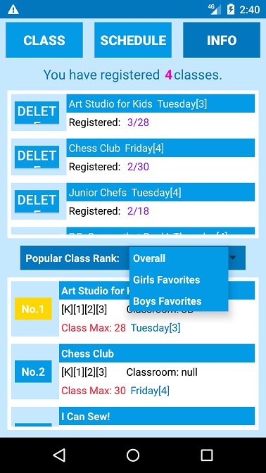

# AndroidClassRegister

This is a one-person project I have created for an elementary school. The project is still in progress. This is the Registration page. I have a Login page, Notification page, and 3 Fragment pages so far. I am using Android Jelly Bean, mysql and php for this app. Please visit my github for more technical information.

